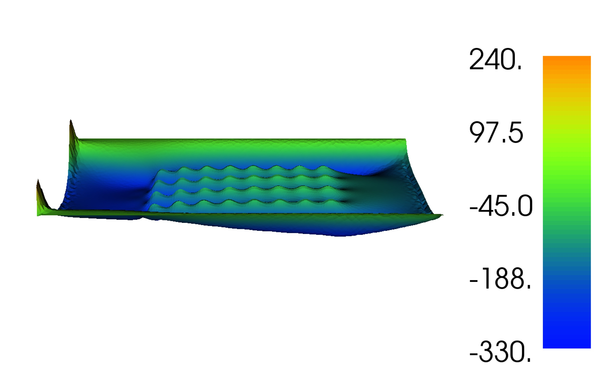
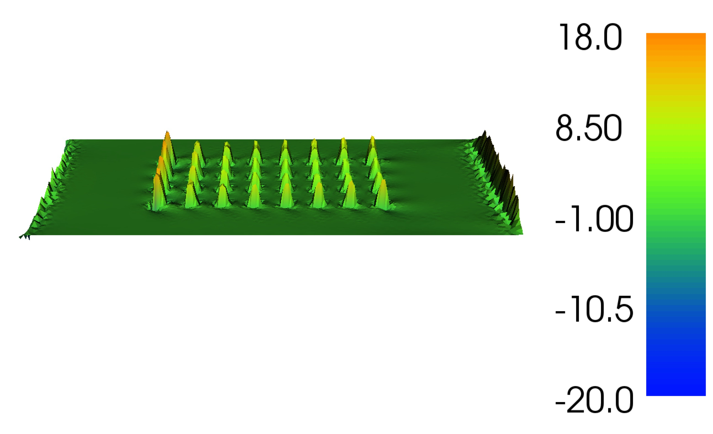
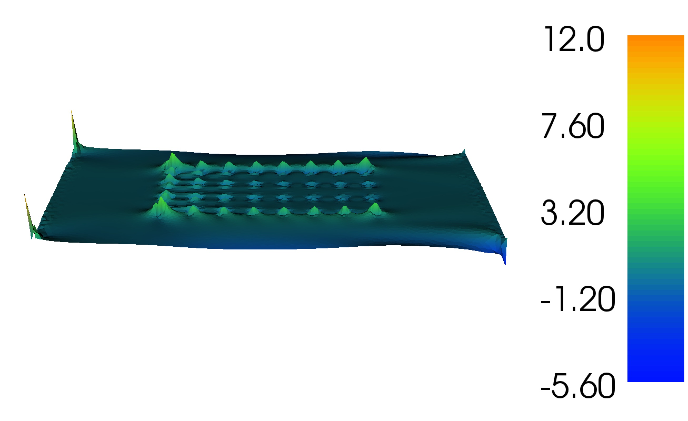

..  #!/usr/bin/env python
  # -*- coding: utf-8 -*-
  
.. _channel_sensitivities:

.. py:currentmodule:: opentidalfarm

Sensitivity analysis
====================

Introduction
************

Gradient information may also be used to analyse the sensitivity of the chosen
functional to various model parameters - for example the bottom friction:

This enables the designer to identify which parameters may have a high impact
upon the quality of the chosen design (as judged by the choice of functional).

This example shows how to:
  - set up shallow water solver with a turbine farm;
  - define an objective, here the farms power production;
  - compute the sensitivity of this objective with respect to:
     - viscosity;
     - depth;
     - bottom friction.

Implementation
**************

As with other examples, we begin by defining a steady state shallow water
problem, once more this is similar to the :ref:`channel_simulation`
example except that we define steady flow driven by a 0.1 m head difference
across the domain. Note that this is facilitated by defining a strong
dirichlet boundary condiditon on the walls:

::

  from opentidalfarm import *
  
  # Create a rectangular domain.
  domain = FileDomain("mesh/mesh.xml")
  
  # Specify boundary conditions.
  bcs = BoundaryConditionSet()
  bcs.add_bc("eta", Constant(0.1), facet_id=1)
  bcs.add_bc("eta", Constant(0), facet_id=2)
  # The no-slip boundary conditions.
  bcs.add_bc("u", Constant((0, 0)), facet_id=3, bctype="strong_dirichlet")
  
Set the shallow water parameters, since we want to extract the spatial variation
of the sensitivity of our model parameters, rather than simply defining constant
values, we define fields over the domain (in this case we're simply defining a
field of a constant value, using dolfin's `interpolate`.

::

  prob_params = SteadySWProblem.default_parameters()
  prob_params.domain = domain
  prob_params.bcs = bcs
  V = FunctionSpace(domain.mesh, "CG", 1)
  prob_params.viscosity = interpolate(Constant(3), V)
  prob_params.depth = interpolate(Constant(50), V)
  prob_params.friction = interpolate(Constant(0.0025), V)
  
The next step is to specify the array design for which we wish to analyse
the sensitivity. For simplicity we will use the starting guess from the
:ref:`channel_optimization` example; 32 turbines in a regular grid layout.
As before we'll use the default turbine type and define the diameter and
friction. In practice, one is likely to want to analyse the sensitivity of
the optimised array layout - so one would substitute this grid layout with
the optimised one.

::

  turbine = BumpTurbine(diameter=20.0, friction=12.0)
  farm = RectangularFarm(domain, site_x_start=160, site_x_end=480,
                         site_y_start=80, site_y_end=240, turbine=turbine)
  farm.add_regular_turbine_layout(num_x=8, num_y=4)
  prob_params.tidal_farm = farm
  
Now we can create the shallow water problem

::

  problem = SteadySWProblem(prob_params)
  
Next we create a shallow water solver. Here we choose to solve the shallow
water equations in its fully coupled form:

::

  sol_params = CoupledSWSolver.default_parameters()
  sol_params.dump_period = -1
  solver = CoupledSWSolver(problem, sol_params)
  
We wish to study the effect that various model parameters have on the
power. Thus, we select the :class:`PowerFunctional`

::

  functional = PowerFunctional(problem)
  
First let's compute the sensitivity of the power with respect to the turbine
positions. So we set the "control" variable to the turbine positions by using
:class:`TurbineFarmControl`. We then intialise the :class:`ReducedFunctional`

::

  control = TurbineFarmControl(farm)
  rf_params = ReducedFunctional.default_parameters()
  rf = ReducedFunctional(functional, control, solver, rf_params)
  m0 = rf.solver.problem.parameters.tidal_farm.control_array
  j = rf.evaluate(m0)
  turbine_location_sensitivity = rf.derivative(m0)
  
  print "j for turbine positions: ", j
  print "dj w.r.t. turbine positions: ", turbine_location_sensitivity
  
Next we compute the sensitivity of the power with respect to bottom friction.
We redefine the control variable using the class :class:`Control` into which
we pass the parameter of interest

::

  control = Control(prob_params.friction)
  
Turbine positions are stored in different data structures (numpy arrays)
than functions such as bottom friction (dolfin functions), so we need to
use a different reduced functional; the :class:`FenicsReducedFunctional`

::

  rf = FenicsReducedFunctional(functional, control, solver)
  j = rf.evaluate()
  dj = rf.derivative(project=True)
  plot(dj, interactive=True, title="Sensitivity with respect to friction")
  
Now compute the sensitivity with respect to depth

::

  control = Control(prob_params.depth)
  rf = FenicsReducedFunctional(functional, control, solver)
  j = rf.evaluate()
  dj = rf.derivative(project=True)
  print "j with depth = 50 m: ", j
  plot(dj, interactive=True, title="Sensitivity with respect to depth at 50m")
  

.. image:: sens_depth50.png
    :scale: 20

Let's reduce the depth and reevaluate derivative

::

  prob_params.depth.assign(Constant(10))
  j = rf.evaluate()
  dj = rf.derivative(project=True)
  print "j with depth = 10 m: ", j
  plot(dj, interactive=True, title="Sensitivity with respect to depth at 10m")
  

Finally let's compute the sensitivity with respect to viscosity

::

  control = Control(prob_params.viscosity)
  rf = FenicsReducedFunctional(functional, control, solver)
  j = rf.evaluate()
  dj = rf.derivative(project=True)
  plot(dj, interactive=True, title="Sensitivity with respect to viscosity")
  

How to run the example
**********************

The example code can be found in ``examples/channel-sensitivity/`` in the
``OpenTidalFarm`` source tree, and executed as follows:

.. code-block:: bash

  $ python channel-sensitivity.py
